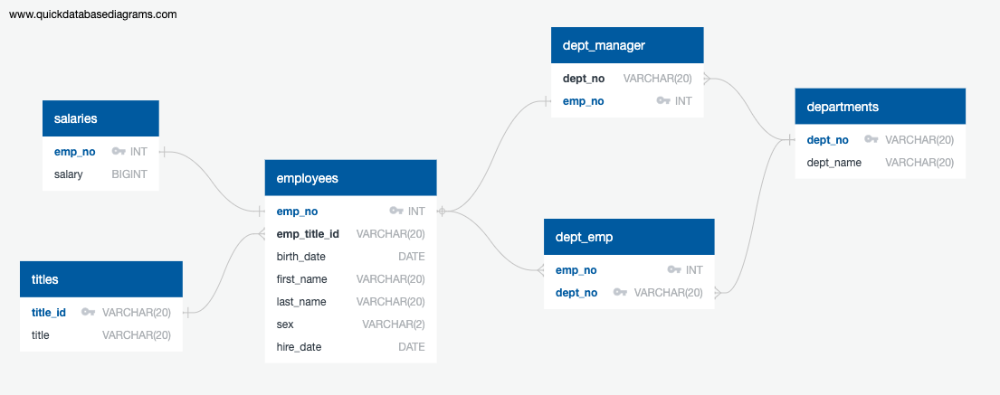

# sql-challenge
The goal of this challenge is to design tables to hold the data from CSV files, import the CSV files into a SQL database, and then write queries to answer specific questions. The items to do are listed below.
## Data Modeling
- [x] Entity Relationship Diagram is included
## Data Engineering
- [x] All required columns are defined for each table
- [x] Columns are set to the correct data type
- [x] Primary Keys are set for each table
- [x] Correctly references related tables
- [x] Tables are correctly related using Foreign Keys
- [x] Correctly uses NOT NULL condition on necessary columns
- [x] Accurately defines value length for columns
## Data Analysis
- [x] List the employee number, last name, first name, sex, and salary of each employee
- [x] List the first name, last name, and hire date for the employees who were hired in 1986
- [x] List the manager of each department along with their department number, department name, employee number, last name, and first name
- [x] List the department number for each employee along with that employee’s employee number, last name, first name, and department name
- [x] List first name, last name, and sex of each employee whose first name is Hercules and whose last name begins with the letter B
- [x] List each employee in the Sales department, including their employee number, last name, and first name
- [x] List each employee in the Sales and Development departments, including their employee number, last name, first name, and department name
- [x] List the frequency counts, in descending order, of all the employee last names (that is, how many employees share each last name)
## Results
Entity Relationship Diagram

